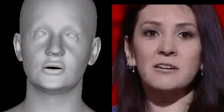
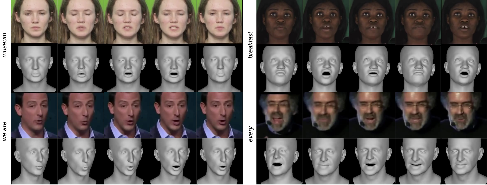

<div align="center">

  # SPECTRE: Visual Speech-Aware Perceptual 3D Facial Expression Reconstruction from Videos

[](https://arxiv.org/abs/2207.11094)
&nbsp; [](https://filby89.github.io/spectre/)
&nbsp; <a href='https://youtu.be/P1kqrxWNizI'>
      
    </a>
</div>

<p align="center"> 


</p>


<p align="center"> 

</p>
<p align="center"> Our method performs visual-speech aware 3D reconstruction so that speech perception from the original footage is preserved in the reconstructed talking head. On the left we include the word/phrase being said for each example. <p align="center">

This is the official Pytorch implementation of the paper:
  
```
Visual Speech-Aware Perceptual 3D Facial Expression Reconstruction from Videos
Panagiotis P. Filntisis, George Retsinas, Foivos Paraperas-Papantoniou, Athanasios Katsamanis, Anastasios Roussos, and Petros Maragos
arXiv 2022
```


## Installation
Clone the repo and its submodules:
```bash
git clone --recurse-submodules -j4 https://github.com/filby89/spectre
cd spectre
```  

You need to have installed a working version of Pytorch with Python 3.6 or higher and Pytorch 3D. You can use the following commands to create a working installation:
```bash
conda create -n "spectre" python=3.8
conda install -c pytorch pytorch=1.11.0 torchvision torchaudio # you might need to select cudatoolkit version here by adding e.g. cudatoolkit=11.3
conda install -c conda-forge -c fvcore fvcore iopath 
conda install pytorch3d -c pytorch3d
pip install -r requirements.txt # install the rest of the requirements
```

Installing a working setup of Pytorch3d with Pytorch can be a bit tricky. For development we used Pytorch3d 0.6.1 with Pytorch 1.10.0. 

PyTorch3d 0.6.2 with pytorch 1.11.0 are also compatible. 

Install the face_alignment and face_detection packages:
```bash
cd external/face_alignment
pip install -e .
cd ../face_detection
git lfs pull
pip install -e .
cd ../..
```
You may need to install git-lfs to run the above commands. [More details](https://stackoverflow.com/questions/48734119/git-lfs-is-not-a-git-command-unclear)  
```bash
curl -s https://packagecloud.io/install/repositories/github/git-lfs/script.deb.sh | sudo bash
sudo apt-get install git-lfs
```
Download the FLAME model and the pretrained SPECTRE model:
```bash
pip install gdown
bash quick_install.sh
```

## Demo
Samples are included in ``samples`` folder. You can run the demo by running 

```bash
python demo.py --input samples/LRS3/0Fi83BHQsMA_00002.mp4 --audio
```

The audio flag extracts audio from the input video and puts it in the output shape video for visualization purposes (ffmpeg is required for video creation).

## Training and Testing
In order to train the model you need to download the `trainval` and `test` sets of the [LRS3 dataset](https://www.robots.ox.ac.uk/~vgg/data/lip_reading/lrs3.html). After downloading 
the dataset, run the following command to extract frames and audio from the videos (audio is not needed for training but it is nice for visualizing the result):

```bash
python utils/extract_frames_and_audio.py --dataset_path ./data/LRS3
```

After downloading and preprocessing the dataset, download the rest needed assets:

```bash
bash get_training_data.sh
```

This command downloads the original [DECA](https://github.com/YadiraF/DECA/) pretrained model,
the ResNet50 emotion recognition model provided by [EMOCA](https://github.com/radekd91/emoca),
the pretrained lipreading model and detected landmarks for the videos of the LRS3 dataset provided by [Visual_Speech_Recognition_for_Multiple_Languages](https://github.com/mpc001/Visual_Speech_Recognition_for_Multiple_Languages).

Finally, you need to create a texture model using the repository [BFM_to_FLAME](https://github.com/TimoBolkart/BFM_to_FLAME#create-texture-model). Due
to licencing reasons we are not allowed to share it to you.

Now, you can run the following command to train the model:

```bash
python main.py --output_dir logs --landmark 50 --relative_landmark 25 --lipread 2 --expression 0.5 --epochs 6 --LRS3_path data/LRS3 --LRS3_landmarks_path data/LRS3_landmarks
```

and then test it on the LRS3 dataset test set:

```bash
python main.py --test --output_dir logs --model_path logs/model.tar --LRS3_path data/LRS3 --LRS3_landmarks_path data/LRS3_landmarks
```

and run lipreading with AV-hubert: 

```bash
# and run lipreading with our script
python utils/run_av_hubert.py --videos "logs/test_videos_000000/*_mouth.avi --LRS3_path data/LRS3"
```


## Acknowledgements
This repo is has been heavily based on the original implementation of [DECA](https://github.com/YadiraF/DECA/). We also acknowledge the following 
repositories which we have benefited greatly from as well:

- [EMOCA](https://github.com/radekd91/emoca)
- [face_alignment](https://github.com/hhj1897/face_alignment)
- [face_detection](https://github.com/hhj1897/face_detection)
- [Visual_Speech_Recognition_for_Multiple_Languages](https://github.com/mpc001/Visual_Speech_Recognition_for_Multiple_Languages)

## Citation
If your research benefits from this repository, consider citing the following:

```
@misc{filntisis2022visual,
  title = {Visual Speech-Aware Perceptual 3D Facial Expression Reconstruction from Videos},
  author = {Filntisis, Panagiotis P. and Retsinas, George and Paraperas-Papantoniou, Foivos and Katsamanis, Athanasios and Roussos, Anastasios and Maragos, Petros},
  publisher = {arXiv},
  year = {2022},
}
```
  
  
